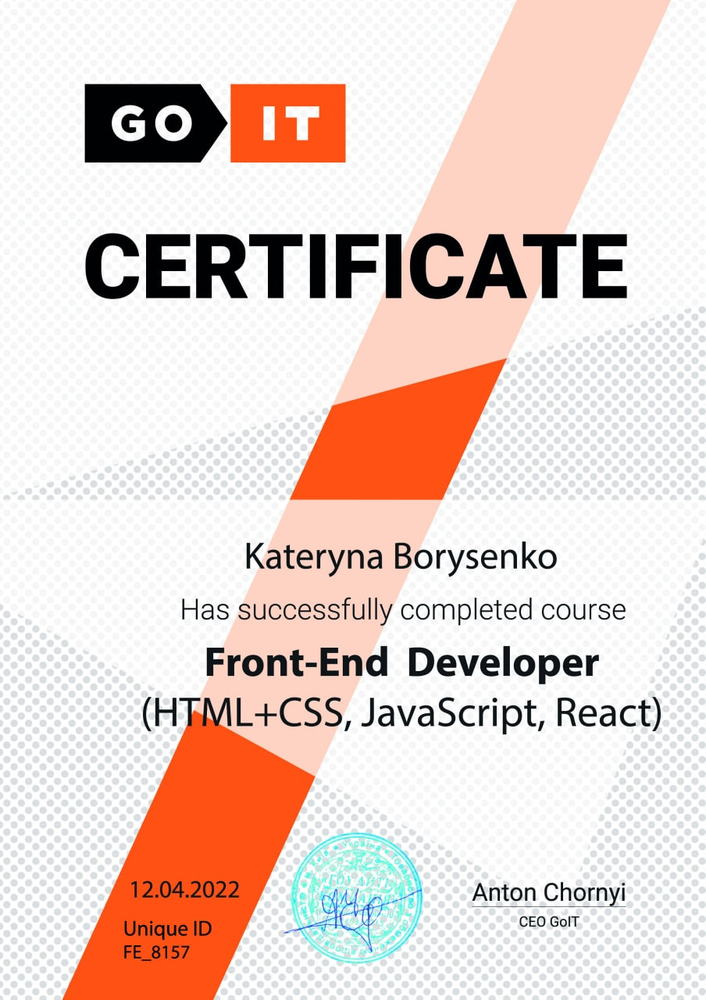
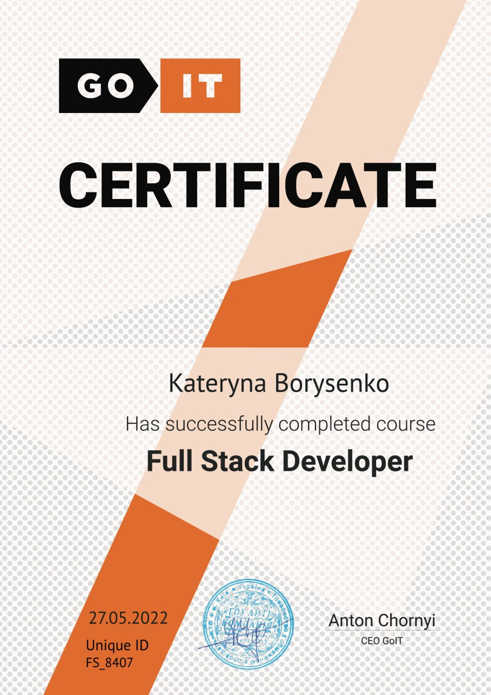

<!-- 

 -->

I am a full-stack developer with a keen interest in AI from 🇺🇦, specializing in JavaScript, HTML, CSS, Node.js, MongoDB, and React. My focus is on developing outstanding, responsive websites tailored to the specific requirements of my clients. I am passionate about addressing challenges through creative solutions and teamwork. 

Feel free to visit my website for further information and to explore my <a href="https://portfolio-three-theta-90.vercel.app" target="_blank" style={{color:red}}>portfolio</a>.

<!--* 👩‍💻 I’m currently working for [Andersen People](https://people.andersenlab.com/) -->

- 🎨 I'm creative.
- 🖥️ I love to do great things and I do it.
- 👩🏻‍💻 Slapping the keyboard until something good happens.
- 📚 I'm an avid learner.
- 🏔 I enjoy traveling and exploring the beauty of nature.

## ⚙️ GitHub Analytics

<!-- ## 🏆 Certificates

 

 -->

## 📫 How to reach me

## 🛠️ Technologies & Tools

&nbsp;
&nbsp;
&nbsp;
&nbsp;
&nbsp;
&nbsp;
&nbsp;
&nbsp;

&nbsp;
  

<!-- ## 💬 Random Dev Quote

 -->

<!--

<table>
<tr>
<td align="center" width="33%">

<a href="https://github.com/Kateryna-Borysenko/portfolio">
   
  PORTFOLIO
</a>

</td>
<td align="center" width="33%">

<a href="https://github.com/Kateryna-Borysenko/proshop">
   
  PROSHOP
</a>

</td>
<td align="center" width="33%">

<a href="https://github.com/Kateryna-Borysenko/erato-apartmens">
   
  ERATO
</a>

</td>
</tr>
</table>

 -->

## 📎 Node JS projects

## 📌 Individual projects

## 📌 Team projects

